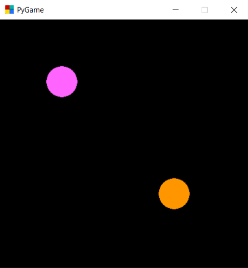

# Py-game
###### A simple game using open-library of Python Py-game

A simple game using Python programming language, through Py-game library. It´s a very tiny app, but is a introdution for 
2D games development with Python. The used library allows many possibilities, just like that:

## Usage

By [W, A, S, D] and [up, down, left, right], you can control each circle. When the pink cirlce pass horizontally through yellow, it change its color.

## Requirements and Installation

Just have the Python 3.7 in your machine (https://www.python.org/downloads/release/python-377/), download the game and execute it.
